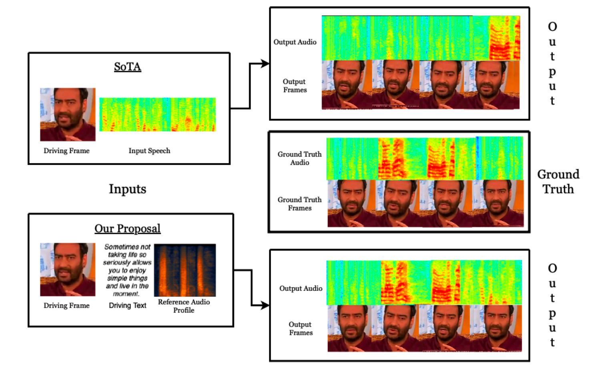

<h1 align='center'>PLAYING FOR YOU: TEXT PROMPT-GUIDED JOINT
AUDIO-VISUAL GENERATION FOR NARRATING FACES
USING MULTI-ENTANGLED LATENT SPACE</h1>

# Goal of the Model compared to SoTA

# Example Generations

## Example - 1

### Input
- **Image** 
- **Text** 
  "Because I was surprised when you did that, I thought this is an interesting choice"
- **Sample Audio**: `.m4a` or `.wav` format

### Output

---

## Example - 2

### Input
- **Image** 
- **Text** 
  "Because I was surprised when you did that, I thought this is an interesting choice"
- **Sample Audio**: `.m4a` or `.wav` format

### Output

