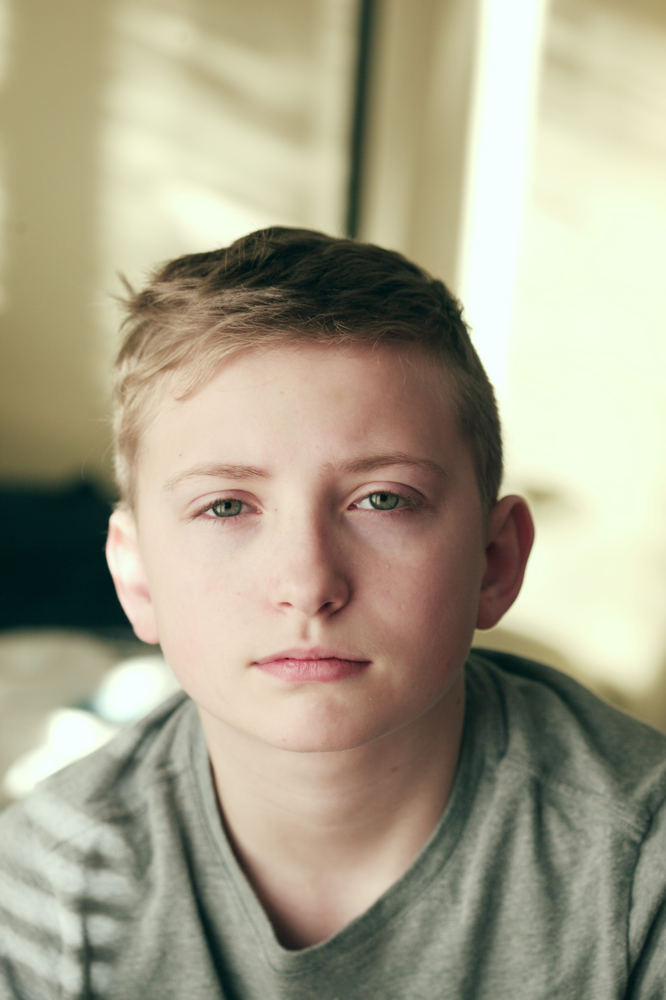
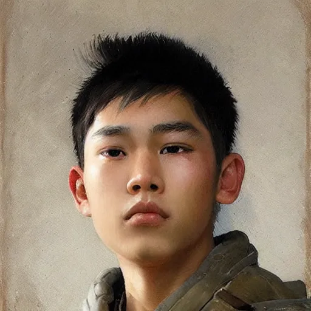

<h1 align='center'>PLAYING FOR YOU: TEXT PROMPT-GUIDED JOINT
AUDIO-VISUAL GENERATION FOR NARRATING FACES
USING MULTI-ENTANGLED LATENT SPACE</h1>

# Goal of the Model compared to SoTA

### Please find the checkpoints for our model that can be loaded into the `torch.load()` function in `train.py` at the following Google-Drive Link:

https://drive.google.com/drive/folders/12i9uzp_n-eu_5aWiYTsdJAvLM_BUwOIl

# Example Generations

## Example - 1

### Input
- **Source Image**  
  
- **Prompt Text** 
  "OR PRODUCERS OR PROCESSORS OR ACCOUNTANTS OR AGRONOMISTS THE LIGHT BULB GOES ON I'VE SEEN IT OVER AND OVER AND PEOPLE WILL SAY WELL WE'RE DOING THIS"
- **Reference Audio**: `.m4a` or `.wav` format

### Output

---

## Example - 2

### Input
- **Source Image**  
  
- **Prompt Text** 
  "Everybody this is senator Marsha Blackburn from the state of Tennesse and I'm just so excited to be a part of this celebration"
- **Reference Audio**: `.m4a` or `.wav` format

The first output uses the Reference Audio, while the second one uses a corrupted version of the same audio profile, with a lower bitrate, sample rate, etc.

### Output

https://github.com/user-attachments/assets/4b1c506f-7c10-4663-9583-3dffb9d141c3

## Example - 3

### Input
- **Source Image**  
  
- **Prompt Text** 
  "GRANTED THAT I'VE BEEN AROUND FOR A WHILE AND DECIDED THEY'LL GET ME IN NOVEMBER SO TO SPEAK BUT I DON'T THINK WE CAN REALLY GO BACK AND RELITIGATE THAT ASPECT OF IT"
- **Reference Audio**: `.m4a` or `.wav` format

### Output

## Examples - 4 & 5

The following 2 outputs show two young boys speaking in adult voices. The second one specifically is an AI-Generated Image of a boy, generated using Stable Diffusion.

### Input
- **Source Image**  
  
- **Prompt Text** 
  "SOMETIMES, THE BEST THING YOU CAN DO IS TO LET GO"
- **Reference Audio**: `.m4a` or `.wav` format

### Output

- **Source Image**  
  
- **Prompt Text** 
  "BE THE CHANGE YOU WANT TO SEE IN THE WORLD, BROTHERS AND SISTERS."
- **Reference Audio**: `.m4a` or `.wav` format

### Output

